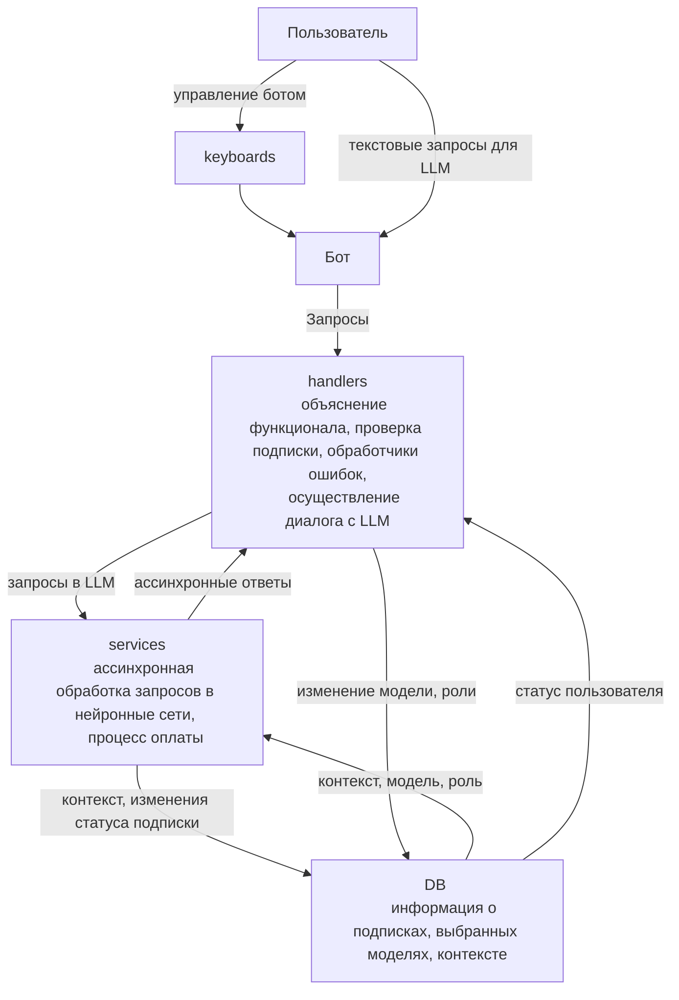

# `Телеграм бот с LLM - Помогатор`

# Структура проекта:
    

# Что видит пользователь:

### `BIO:`

    В Bio указана минимальная информация о том, что умеет бот
    
    Также указан аккаунт поддержки  

## Команды:

### `1. /start`
    
    Минимальное описание бота.
    (По запуску начинается процесс добавления пользователя в базу данных)
    
    К сообщению прикреплены кнопки, дублирующие функционал команд.

### `2. /help`

    Инструкции по работе с ботом.
    Объяснение функционала всех доступных комманд.
    Аккаунт поддержки.

### `3. /model - Выбор модели`
    
    Пользователю предлагется сменить модель.
    В сообщении указывается количество запросов в сутки
    для обычных и премиальных пользователей для каждой модели

    К сообщению прикреплены кнопки для выбора модели.
      - текущая модель на кнопках отмечена эмодзи галочки
      - модели требующие премиум подписки отмечены эмодзи замка
      - кнопка выход закрывает меню

### `4. /role - Выбор роли`

    Пользователю предлагется сменить роль модели.
    После запуска команды бот ожидает сообщения, в котором описана роль.
    
    К сообщению прикреплены кнопки:
      1. Отмена
      2. Удалить роль

### `5. /profile - Профиль`

    Указана информация о пользоватале:
      1. Роль модели
      2. Выбранная модель
      3. Количество запросов за текущие сутки
      4. Статус премиум подписки

### `6. /billing - Покупка подписки`

    Предлагается выбрать план подписки, прикреплены 2 кнопки:
      1. План на месяц за 599р.
      2. План на год за 1999р.
    
    По нажатию на кнопку приходит сообщение
    с ссылкой на оплату соответсвующей суммы.
    После верефикации оплаты, приходит подтвердающее
    сообщение и активириуется премиум подписка

### `7. /delete_context - Очистка контекста`
    
    Очищается контекст

## Любое сообщение кроме команд/кнопок:

    Текст сообщения будет передан в выбранную модель
    Ответ будет презентован пользователю.

    При изросходованном лимите запросов в доступе будет отказано.

# Stack:

    Язык: Python
    Бот: Aiogram
    Базы данных: postgresql+asyncpg
    Биллинг: FastApi, Uvicorn, Yookassa
    Логгирование: Logging
    Тестирование: Pytest

## Какие задачи необходимо выполнить.

    1. База данных пользователей + CRUD
    2. Телеграм Бот: UI, Хэндлеры
    3. Работа с API OpenRouter через SDK OpenAi, стриминг, форматировние ответа, обработка файлов.
    4. База данных биллинга
    5. Работа с API платежного сервиса, верификация платежа
    6. Деплой
    7. Обработка ошибок
    8. Логгирование и его база данных
    9. Тестирование
    10. Докер

## Сколько времени потребуется на каждую задачу:

### `1 неделя:`
    Задачи 1-2: ~8-10 часов на каждую 

### `2 неделя:`
    Задачи 3-5: ~20 часов на API LLM, ~10 час на биллинг

### `3 неделя:`
    Задача 6: ~6 часов
    Задачи 7-8: ~15 часов
    Задача 9: ~6 часов
    Задача 10: ~2 часа

## Кто что делает в команде:

### `Степан Карлов (TL):`

    Дизайн, архитектура проекта, контроль и генерация задач, принятие решений

    Задачи:
    1, (2), 3, 7, 8

### `Владислав Долгов (Dev):`

    Задачи:
    (2), 4, 6, 8, 9, 10

