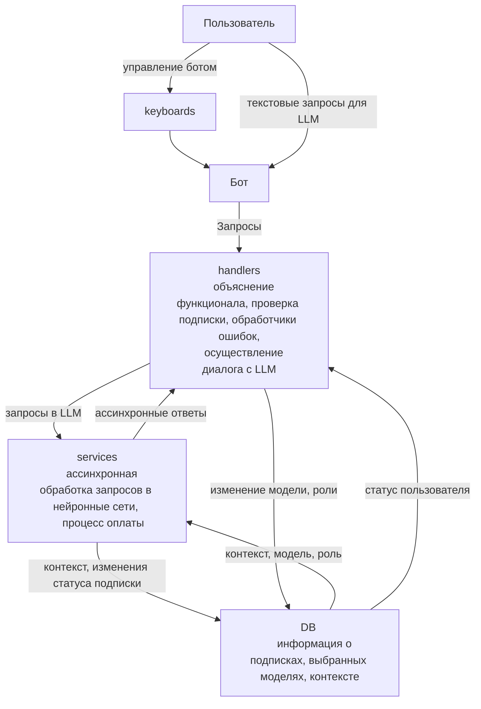

# NeuroTgBot
Телеграм бот с нейросетями

**не ругайтесь пж это не формализованная документация мы все потом доделаем и красиво напишем, но вроде всю главную информацию здесь написали**

## Что видит пользователь.

### Био бота:

в био указана минимальная информация о боте  
указан акк поддержки

### /start
приветствие

минимальное руководство по использованию  
функционал бота

презентация доступных моделей 

пользовательское соглашение (типо строчка, продолжая вы соглашаетесь с условиями пользовательского соглашения и ссылка на него, но мы его писать не будем конечно пока просто заглушкой будет)

**[В НИЖНЕЙ СТРОКЕ КНОПОЧКИ: ВЫБОР МОДЕЛИ И ПРОФИЛЬ]**

### /help

указание всех возможных комманд с описанием их работы

**[/model /role /profile (/start / help)]**

тг акк поддержки

### /model - Выбор модели

минимальное описание крутости (типо что gpt 5.1 > gpt 5 > gpt 4 > gpt 4o mini)  
описание возможностей модели по работе с документами. 
и ограничение по кол-ву запросов в сутки и необходимости премиума для доступа  

Упоминается что можно указать роль для модели команда /role

**[КНОПОЧКИ ПОД СООБЩЕНИЕМ: КАЖДАЯ МОДЕЛЬ ОТДЕЛЬНОЙ КНОПОЧКОЙ, НА ВЫБРАННОЙ МОДЕЛИ ЭМОДЖИ ГАЛОЧКИ И КНОПКА ЗАКРЫТЬ]**

### /role - Выбор роли

"Задать роль, будет работать для тех моделей, которые поддерживают эту функцию"

**[КНОПОЧКИ ПОД СООБЩЕНИЕМ: ЗАДАТЬ РОЛЬ, УДАЛИТЬ РОЛЬ, ЗАКРЫТЬ]**

при нажатии задать роль бот присылает что ждет следующее сообщение от пользователя  

**[ТУТ ТОЖЕ КНОПОЧКА ЗАКРЫТЬ ПОД СООБЩЕНИЕМ]**

если в сообщении задается не роль а другая команда то все это то же самое что нажать кнопку закрыть

### Любое сообщение кроме команд

текст сообщения будет передан в выбранную модель (по умолчанию наверное это будет gpt 4o mini) и ответ будет презентован пользователю

при изросходованном лимите запросов в доступе будет отказано  
и предложено купить премиум подписку

## Какие задачи необходимо выполнить.

1. Накидать минимальный макет бота без дизайна описаний просто кнопки, только экранный функционал

2. параллельно первой задаче изучить как работать с api/sdk разных моделей
получить необходимые апи ключи, купить прокси для запросов

3. Создать макет базы данных + crud [u_id, user_tg_id, is_premium, cur_model, request_cnt] [add_user, get_user_info, delete_user, change_model, ...], которые по необходимости могут дорабатываться при последующих задачах

4. зафиналить api запросы и все к ним прилагающееся (загрузка контеста из бд, как и его добавление) (удаление контекста из бд по кнопке и при смене модели)

5. Зафиналить ui бота

6. Подумать как можно реализовать локальные модели на домашнем пк степы
чтобы сервак кидал на него запрос и пк давал ответ
(на такие модели можно будет давать значительно большее ограничение по запросам и в день (хранить больше контекста) ведь они локальные и запросы будут стоять только цену потраченную на электричество)
ну после того как подумали надо соответсвенно и реализовать

7. добавить оплату в бота (можно это будет просто заглушка мы не хотим открывать ИП для приема платежей)

8. тесты

9. если будет возможность и желание все это перенести в докер

10. Арендовать сервак и туда все это положить

## Сколько времени потребуется на каждую задачу.

### 1 неделя:  
на 1 и 2 задачу потребуется **[8 часов]** (ну по целому дню крч) они будут делаться параллельно  
### 2 неделя:  
3 задача **[4 часa]**  
4 задача **[6 часов]**  
5 задача **[3 часа]**  

### 3 неделя:
6 задача **[6 часов]**  
7 задача **[1 час? будет просто заглушка наверное]**  
8 задача **[8 часов]**  
9 задача со звездочкой **[6 часов]**  
10 задача **[3 часа]**

## Кто что делает в команде.

я думаю, что у нас не особо будет строгое разделение на задачи под человека.
скорее всего по большей части все будет делаться вместе (нас всего двое и так мы сможем оба попрактиковаться во всех частях проекта), но формальное распределение задач такое:

#### **(Степа TL):**

[Дизайн тг бота  
общая концпеция проекта]

##### Задачи:
2, 3, 4, 6, 10

#### **(Влад Dev1):**

##### Задачи:
1, 5, 7, 8, 9

